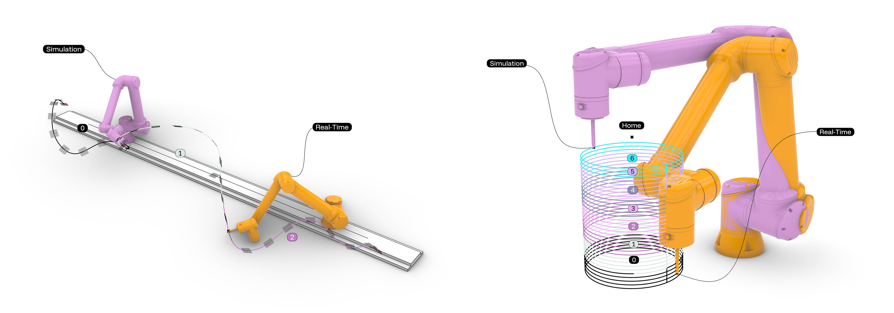

# UR RTDE Program Cue Loop in Grasshopper
###### RTDE-based UR program cue looping in Grasshopper with Robots plugin. Features 2 workflows using runtime_state monitoring to upload programs sequentially: (1) 3D printing with large toolpath splitting and (2) milling with automated rail repositioning.



## Overview

This repository contains Grasshopper workflows for **sequential UR program execution using RTDE feedback**. Rather than sending one large program, toolpaths are split into multiple URPs that are **automatically queued and run** using `runtime_state` monitoring. The **Robots plugin** handles upload, while a **C# RTDE client** streams live data to Grasshopper for cueing and visualization.

Two example files are included:

* **3D Printing** — split toolpaths for large-format extrusion
* **Milling + Rail** — automated base shifting per program for multi-position milling

The repository also provides the **RTDE variable index list** and the **C# client scripts** required for real-time feedback.

**Plugins required:**

* **[Robots](https://www.food4rhino.com/en/app/robots)** _(by visose)_ — core plugin for generating UR programs and controlling robot motion.
* **[Heteroptera](https://www.food4rhino.com/en/app/heteroptera)** _(by Amin Bahrami)_ — for data flow control and triggers.
* **[Pufferfish](https://www.food4rhino.com/en/app/pufferfish)** _(by ekimroyrp)_ — miscellaneous components supporting workflow logic.

> Ensure all plugins are installed before opening the example definitions.

## Grasshopper Workflow

The Grasshopper setup establishes a **program cue loop** where multi-part robot jobs run in sequence without manual intervention. A long toolpath (for printing or milling) is first **split into multiple UR programs**, each representing one segment of the fabrication task. Splitting serves two purposes:

1. Keeping each program under the controller buffer limit (*[≈2500 targets when uploaded remotely through Robots](https://github.com/visose/Robots/discussions/112), up to ~80,000 when loaded via USB/FTP*).  
2. Enabling the workaround for **7th-axis rail movement**, where the toolpath is divided whenever a rail repositioning is required so each segment stays in reach of the robot. As mentioned in the Robots repository's discussion, [UR kinematics is not yet compatible with a 7th axis](https://github.com/visose/Robots/discussions/106#discussioncomment-1740335).

```
           Program Sequencer ⟶ Simulation
                   ↑
Toolpath ⟶ Split Programs ⟶ Trigger Queue ⟶ Remote Upload ⟶ RUN
                                     ↑
                                    RTDE ⟶ Real-time Preview
```

Program execution works through two parallel systems:

* **Robots Remote Interface** — uploads and runs each URP program  
* **RTDE Client (read-only)** — monitors robot status and detects when a program stops

When `runtime_state = Stopped`, the **Heteroptera "Oil Can" component** fires the trigger that uploads the next UR program in the queue, enabling continuous execution without operator input. A **Program Sequencer** branches out from the program list only for **preview/index visualization**, allowing simulation of the sequence before running it on the robot. The `actual_TCP_pose` from the RTDE client can be fed into the Robots **Kinematics** component for real-time inverse kinematics calculation and visualization in Rhino.

This makes it possible to toggle between **simulation and real execution using the same definition**.

<details>
<summary><strong>Click to expand the list of runtime_state values ↓</strong></summary>

```
0 = Stopping / Not Running
1 = Stopped
2 = Running / Playing
3 = Pausing
4 = Paused
5 = Resuming
```

</details>

This structure supports:

* **large-scale 3D printing** using segmented toolpaths
* **milling with rail repositioning**, where each segment recalculates the base to match the new rail position

In both workflows, the cue mechanism remains identical — only the geometry logic changes.

## Example 1 — Large Toolpath 3D Printing

📂 Grasshopper file:
[`UR_Printing_Cue_Loop.gh`](https://github.com/cxlso/UR_RTDE_ProgramCue_GH/raw/refs/heads/main/Grasshopper/UR_Printing_Cue_Loop.gh)

This example demonstrates splitting a long toolpath into smaller program chunks to avoid size limitations and improve reliability during large prints. Each segment is exported as a separate URP and executed in sequence using the cue loop described above.

> 🔁 When program N finishes, `runtime_state` = Stopped → next program uploads automatically.

Includes:

* toolpath segmentation slider
* program batching logic
* optional simulation playback
* remote control upload and monitoring

**Screenshot:**
*(Insert image or drag under this header)*

## Example 2 — Milling with Rail Repositioning

📂 Grasshopper file:
[`UR_Milling_Cue_Loop.gh`](https://github.com/cxlso/UR_RTDE_ProgramCue_GH/raw/refs/heads/main/Grasshopper/UR_Milling_Cue_Loop.gh)

This workflow demonstrates milling with a rail that is **not configured as a 7th axis** in Robots. Instead, each target group is processed as a separate program, and the **rail base position is recalculated per program**. The base value is sent to the Vention rail controller via a custom URCap init command, effectively simulating multi-axis capability.

> For each program:
> target group → find closest rail position → update base → upload → run → cue next.

Includes:

* automatic rail repositioning based on target group centroid
* independent URP programs per motion set
* same cue structure as printing workflow
* simulation + real execution toggle

**Screenshot:**
*(Insert image or drag under this header)*

## RTDE Client Script

This repository includes a **Grasshopper C# RTDE client** used only to **read live feedback** from a Universal Robot — *not to upload or run programs*. Program sending is handled through the standard **Robots plugin remote interface**, while this client runs in parallel to monitor machine state.

> **I am not the author of these scripts.**
> I found them online some time ago and cannot relocate the original source (please let me know if you find the source).
> I believe they were written by [**Visose**](https://github.com/visose), the creator of the Robots plugin.
> I only updated them to work inside the newer Grasshopper C# environment

The script exposes functions implemented in the Robots plugin [RTDE layer](https://github.com/visose/Robots/blob/master/src/Robots/Remotes/URRealTimeDataExchange.cs).

It connects to the robot, reads the `URRealTimeDataExchange` outputs, and makes them available to Grasshopper for tasks such as:

* tracking `runtime_state` to cue next program
* monitoring `script_control_line`
* providing real-time `actual_TCP_pose`

### DLL Linking Note

Since Rhino/Grasshopper 8 changed the C# component behavior, the script requires manual reference to the `Robots.dll` library.

Example path (adjust to your install):

```
C:\Users\[USERNAME]\AppData\Roaming\McNeel\Rhinoceros\packages\8.0\Robots\1.9.0\Robots.dll
```

### Files Included

📂 [`URRTDE_Client.cs`](CSharp/URRTDE_Client.cs)
Reads RTDE outputs live and returns values + logs.

📂 [`URRTDE_Variables.cs`](CSharp/URRTDE_Variables.cs)
Lists all available RTDE variable names from the Robots plugin.

<details>
<summary><strong>Click to expand list ↓</strong></summary>

```
 0. timestamp
 1. target_q
 2. target_qd
 3. target_qdd
 4. target_current
 5. target_moment
 6. actual_q
 7. actual_qd
 8. actual_current
 9. joint_control_output
10. actual_TCP_pose
11. actual_TCP_speed
12. actual_TCP_force
13. target_TCP_pose
14. target_TCP_speed
15. actual_digital_input_bits
16. joint_temperatures
17. actual_execution_time
18. robot_mode
19. joint_mode
20. safety_mode
21. safety_status
22. actual_tool_accelerometer
23. speed_scaling
24. target_speed_fraction
25. actual_momentum
26. actual_main_voltage
27. actual_robot_voltage
28. actual_robot_current
29. actual_joint_voltage
30. actual_digital_output_bits
31. runtime_state
32. elbow_position
33. elbow_velocity
34. robot_status_bits
35. safety_status_bits
36. analog_io_types
37. standard_analog_input0
38. standard_analog_input1
39. standard_analog_output0
40. standard_analog_output1
41. io_current
42. euromap67_input_bits
43. euromap67_output_bits
44. euromap67_24V_voltage
45. euromap67_24V_current
46. tool_mode
47. tool_analog_input_types
48. tool_analog_input0
49. tool_analog_input1
50. tool_output_voltage
51. tool_output_current
52. tool_temperature
53. tcp_force_scalar
54. output_bit_registers0_to_31
55. output_bit_registers32_to_63
56. output_bit_register_X (X = [64..127])
57. output_int_register_X (X = [0..47])
58. — reserved / not used —
59. — reserved / not used —
60. output_double_register_X (X = [0..47])
61. — reserved / not used —
62. — reserved / not used —
63. input_bit_registers0_to_31
64. input_bit_registers32_to_63
65. input_bit_register_X (X = [64..127])
66. input_int_register_X (X = [0..48])
67. — reserved / not used —
68. — reserved / not used —
69. input_double_register_X (X = [0..48])
70. — reserved / not used —
71. — reserved / not used —
72. tool_output_mode
73. tool_digital_output0_mode
74. tool_digital_output1_mode
75. payload
76. payload_cog
77. payload_inertia
78. script_control_line
79. ft_raw_wrench
```

</details>

## Photos & Videos

</img> 

https://github.com/user-attachments/assets/fd91012d-67a6-480a-8aae-c6483b480235

## Contributing

Contributions and suggestions are welcome.
Please submit a pull request or open an issue to discuss improvements.

## License

[![CC BY-NC-SA 4.0][cc-by-nc-sa-shield]][cc-by-nc-sa]

This work is licensed under a [Creative Commons Attribution-NonCommercial-ShareAlike 4.0 International License][cc-by-nc-sa].

[![CC BY-NC-SA 4.0][cc-by-nc-sa-image]][cc-by-nc-sa]

## Acknowledgements

This project was developed partially at the [School of Architecture of Florida Atlantic University](https://www.fau.edu/artsandletters/architecture/).
My thanks go to [Luigi Pacheco](https://luigipacheco.com/), director of the [Interactive Machines Lab](https://www.instagram.com/imachineslab), for granting access to the robotic equipment and for supporting my work.

I am also grateful to the [FIU RDFlab](https://carta.fiu.edu/roboticslab/) for providing access to their facilities. Collaboration with research assistant **Sujay Kumarji** helped shape several ideas during brainstorming sessions.

Luigi Pacheco’s project **[Animaquina](https://github.com/luigipacheco/animaquina-UR)** shares similarities with the workflow presented here, and likely influenced parts of this research, even if indirectly.
I would also like to acknowledge **[Robin Godwyll](https://github.com/robin-gdwl)** for his extensive documentation on Universal Robots integration with the *Robots* plugin — a resource I relied on often.
And finally, special thanks to **[visose](https://github.com/visose)** for developing, maintaining and open-sourcing **[Robots](https://github.com/visose/Robots)** for Grasshopper, without which this workflow would not exist.

<!-- Shields and link definitions -->

[cc-by-nc-sa]: http://creativecommons.org/licenses/by-nc-sa/4.0/
[cc-by-nc-sa-image]: https://licensebuttons.net/l/by-nc-sa/4.0/88x31.png
[cc-by-nc-sa-shield]: https://img.shields.io/badge/License-CC%20BY--NC--SA%204.0-lightgrey.svg
